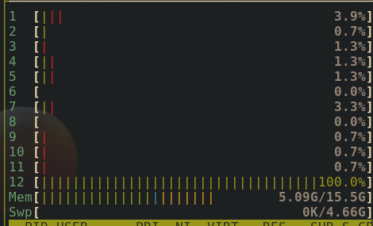
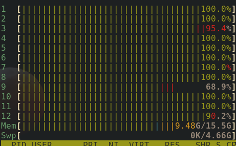

# Parallel mAP_evaluation

This repo parallelizes [mAP_evaluation](https://github.com/lyft/nuscenes-devkit/blob/master/lyft_dataset_sdk/eval/detection/mAP_evaluation.py) using python's multiprocessing module.

As we know, in Lyft's 3d object detection challenge, the evaluation metric mAP is calculated as mean of mAPs for IoU thresholds 0.5, 0.55, 0.6, ... 0.95, (see [here](https://github.com/lyft/nuscenes-devkit/blob/master/lyft_dataset_sdk/eval/detection/mAP_evaluation)) looping over these 10 thresholds one by one can be time consuming process. Here's how it looks when you do so:



Only one hyperthread is fully utilized, rest are idle.

In this repo, you can find the parallelized implementation of mAP evaluation (`mAP_evaluation.py`) which uses Python's inbuilt multiprocessing module to compute APs for all 10 IoUs parallelly and simultaneously. Here's how it looks using parallelized version:



The parallel implementation is ~10x faster than the for loop implementation.


## Requirements

* lyft's devkit sdk [link](https://github.com/lyft/nuscenes-devkit/)
* fire
* pathlib
* numpy

## Instructions

As official mAP_evaluation script, this script also expects the predictions and ground truth to be in the format:

`pred_file`: json file, predictions in global frame, in the format of:

```
predictions = [{
    'sample_token': '0f0e3ce89d2324d8b45aa55a7b4f8207fbb039a550991a5149214f98cec136ac',
    'translation': [971.8343488872263, 1713.6816097857359, -25.82534357061308],
    'size': [2.519726579986132, 7.810161372666739, 3.483438286096803],
    'rotation': [0.10913582721095375, 0.04099572636992043, 0.01927712319721745, 1.029328402625659],
    'name': 'car',
    'score': 0.3077029437237213
}]

```

`gt_file`: ground truth annotations in global frame, in the format of:

```
gt = [{
    'sample_token': '0f0e3ce89d2324d8b45aa55a7b4f8207fbb039a550991a5149214f98cec136ac',
    'translation': [974.2811881299899, 1714.6815014457964, -23.689857123368846],
    'size': [1.796, 4.488, 1.664],
    'rotation': [0.14882026466054782, 0, 0, 0.9888642620837121],
    'name': 'car'
}]
```

`output_dir`: a directory to save the final results.

I've given a sample `pred_file` and `gt_file` in the `tmp` folder of this repository.
Here's how you can run the evaluation script:

```
python mAP_evaluation.py --gt_file="tmp/gt_data.json" --pred_file="tmp/pred_data.json" --output_dir="tmp/"
```


After this command finishes, you'll find metric_summary.json file in tmp containing the mAPs of all the iou thresholds as well as the overall mAP.


Enjoy!
